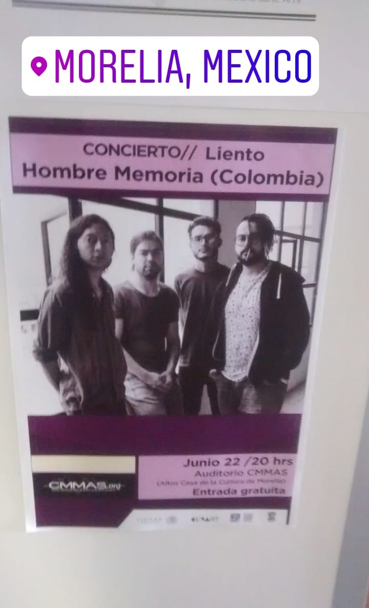
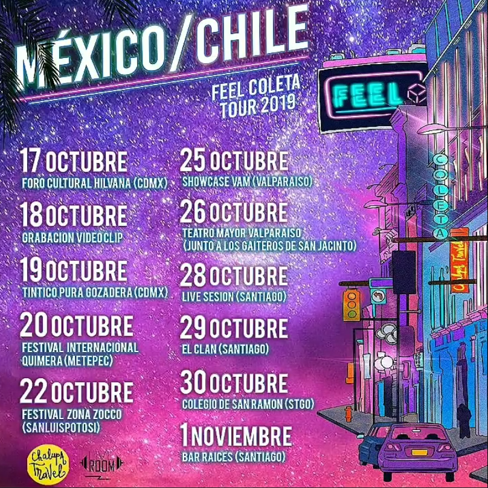
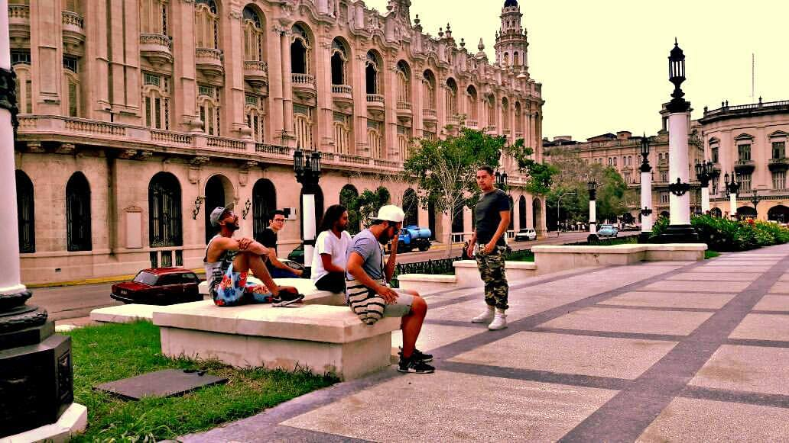
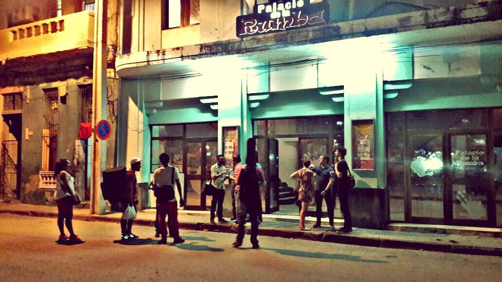
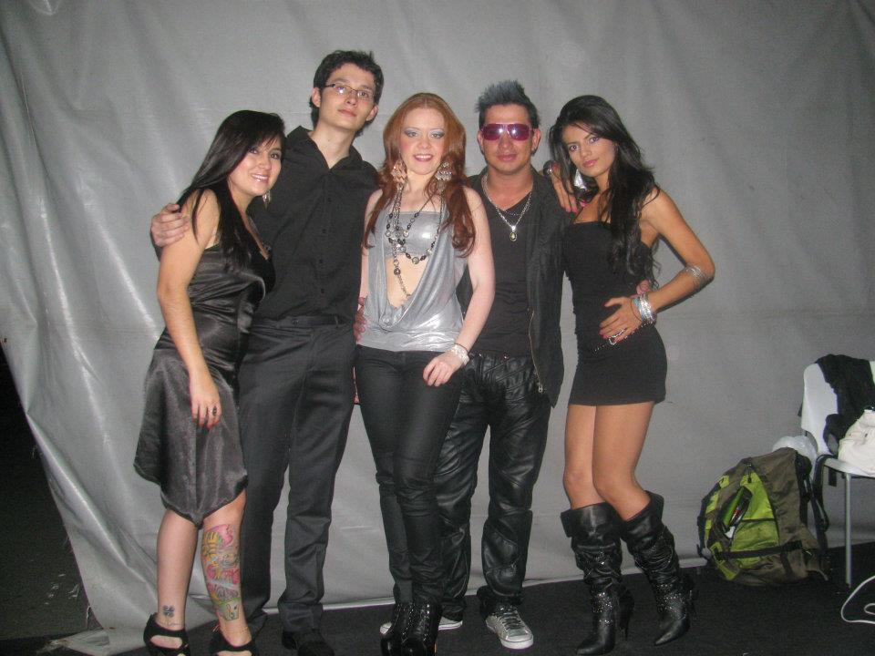
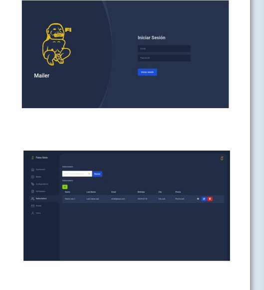

# Julián Loaiza | Proyectos

# +50 Tracks grabadas para diferentes artistas (Bajo y Contrabajo)

[Playlist Spotify](https://open.spotify.com/playlist/1BVxf2RJHRaa5bDZgxVjXt?go=1&sp_cid=35f36715e88f78b709bf8e26f31af208&utm_source=embed_player_p&utm_medium=esktop&nd=1&dlsi=4757f5feea394503)

# Músico de sesión en un track del documental "The Smiling Lombana" (Contrabajo)

# Bajista para Solo Valencia Vive Latino CDMX 2023 (Bajo eléctrico)

# Gira España con Metropolizón 2016 (Bajo eléctrico)

[Video de la gira](https://www.youtube.com/watch?v=ojWndmvgfsM)

# Gira México con Hombre Memoria 2016 (Bajo eléctrico)

# Gira Chalupa Travel México 2019 (Bajo eléctrico)

# Gira Chalupa Travel Cuba 2016 (Bajo eléctrico)

# Daniela Mass Opening Act Ricardo Arjona Tour Colombia 2012 (Bajo eléctrico)

# Antonia Jones Opening act Juanes Tour Colombia 2024 (Guitarra Electroacústica)

[Link Tik Tok](https://www.tiktok.com/@/video/7370099283800116486?_r=1&_d=secCgYIASAHKAESPgo8p2xuKNRgwSIWS0fzI%2BTZN7k%2F1WGgTmIFsVVg786h5oJ9uWDMlzJ2gxYP%2BleQ0IvnJxfxHfiNmOksq7PMGgA%3D&u_code=ed0j2k4l461did&share_item_id=7370099283800116486&timestamp=1715994018&utm_campaign=client_share&utm_source=short_fallback&share_app_id=1233)

# Grabación Ignacio Arango, "Primer Doctorado en Canto" de Medellin (Napoli, Italia 1961) Tracks 1,4,8 y 9 (Contrabajo y Bajo eléctrico)

[Link Bandcamp](https://ignacioarango.bandcamp.com/album/te-quiero)

# Álbum Medellín Tiene Aire de Tango (Arreglos y Contrabajo)

[Link Spotify](https://open.spotify.com/album/2Y3dRke8mSmDEd5ZkbARws?si=he4-xqdqS1S2-VU22sKfBQ)
# Música original para la serie ExorcizArte Pablo de  Teleantioquia (Composición Bajo y Teclados)

[Link Teleantioquia](https://exorcizarte.teleantioquia.co/capitulos/)

# Diseño, Desarrollo y Deploy de los sitios web (Javascript, HTML5, CSS3 , Bootstrap y Bulma)

[Link Falso Ídolo](https://www.falsoidolo.com/)

[Link Solo Valencia](https://solovalencia.com.co/)

[Link Músicos de Fondo](https://musicosdefondo.com/)

[Link MtBand](https://www.mtband.co/)

# Secuenciador bajo web (Tone JS + Svelte)

[Demo en Vercel](https://bass-tech.vercel.app/)

# Webmaster blog El Hilo Noticias (Wordpress)

[Link Blog](https://www.elhilonoticias.com/)

# Soporte técnico Corporación Común y Corriente (Squarespace y Tienda nube)

[Link La Pascasia](https://lapascasia.org/)

# Explicación paso a paso de la Transformada de Fourier (Python y Numpy)

[Link Kaggle](https://www.kaggle.com/code/joolean14/understanding-the-fourier-transform)

# Implementación de Delay Offline en Python usando Procesamiento Digital de Señales (Python y Numpy)

[Link Colab](https://colab.research.google.com/drive/1xJtJERiOyjMnwMHfyNM93foHYs89KOEm?usp=sharing)

# Explicación de entramiento de una Red neuronal a mano usando el algoritmo de retropropagación

[Markdown en Github](https://github.com/Joolean14/nn-a-mano)
# Scraping base de datos letras Billie Holiday y Entrenamiento de aprendizaje no supervisado de una red neuronal (Python, NLTK, Sklearn, Pandas y Matplotlib)

[Post elhilonoticias.com](https://www.elhilonoticias.com/2024/08/31/fruta-extrana-y-billie-holiday/)
# Generación de letras al estilo The Beatles con cadenas de Markov (Machine Learning) (Python y NLTK)

[Link Kaggle](https://www.kaggle.com/code/joolean14/generating-lyrics-from-markov-chains)
# Mailer para evitar costo a terceros como Mailchimp (PHP, Laravel y Amazon SES)

